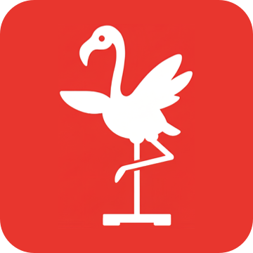

<table border="0">
  <tr>
    <td width="150" valign="middle" align="center">
      
    </td>
    <td valign="middle">
      <h1>The Balance Toolkit</h1>
      <p><em>Source code for our CHI PLAY 2026 toolkit for repurposed Wii Balance Boards.</em></p>
    </td>
  </tr>
</table>

**[Install](INSTALL.md)** &middot; **[Desktop frontend](src/)** &middot; **[Tauri backend](src-tauri/)** &middot; **[Android](android/)** &middot; **[Python scripts](scripts/)** &middot; **[Ready-to-run apps](https://github.com/trecitano/The-Balance-Toolkit-Apps)**

---

This repository holds the source code for **_The Balance Toolkit: Democratizing Balance-Based Interaction Through Open-Source Software for Repurposed Wii Balance Boards_** (CHI PLAY 2026). It contains the cross-platform desktop application, Android application, streaming tools, and platform support files used to reproduce and extend the system described in the paper.

The Balance Toolkit turns an inexpensive consumer Wii Balance Board (WBB) into a research and development platform for balance-based games, rehabilitation, and accessible play. It handles Bluetooth pairing, reads the four force sensors, computes center of pressure (CoP) and posturography metrics, records sessions, replays captured data, and streams live data to games and analysis tools over TCP and Lab Streaming Layer (LSL).

## Video walkthrough

<a href="https://youtu.be/_8UwrUgqUao">
  
</a>

Watch the full walkthrough on [YouTube](https://youtu.be/_8UwrUgqUao).

## Repository layout

The desktop application is the core of the toolkit. The Android app is a companion and standalone capture application. The Python scripts consume the streams emitted by the desktop app for inspection and integration testing.

| Folder | Contents | Guide |
|---|---|---|
| [`src/`](src/) | Desktop frontend built with React, TypeScript, Vite, and Tauri APIs | [Install](INSTALL.md) |
| [`src-tauri/`](src-tauri/) | Rust backend for Bluetooth, session state, processing, recording, replay, TCP, and LSL | [Install](INSTALL.md) |
| [`android/`](android/) | Android application built with Kotlin and Jetpack Compose | [Read](android/README.md) |
| [`scripts/`](scripts/) | Python scripts for inspecting the LSL and TCP data streams | This README |
| [`public/activities/`](public/activities/) | Activity illustrations and toolkit artwork used by the desktop app | This README |
| [`linux/`](linux/) | Linux udev rules for Wii Balance Board HID access | [Install](INSTALL.md) |
| [`resources/`](resources/) | Research support files, including expert survey results | This README |

Packaged applications and integration examples are published separately in [The Balance Toolkit - Apps](https://github.com/trecitano/The-Balance-Toolkit-Apps).

## What the toolkit does

- **Cross-platform desktop app** for Windows, macOS, and Linux, built with Rust, Tauri, React, and TypeScript.
- **Android companion app** for Bluetooth board connection, live sessions, user/device management, and standalone session capture.
- **Bluetooth connectivity** to Wii Balance Boards, including support for one or two boards in a session.
- **Data processing pipeline** that computes center of pressure, sway, spatial and stability metrics, and frequency analysis.
- **Real-time streaming** over TCP and LSL, so games and analysis tools can consume live raw and processed data.
- **Six posturography activity templates**: Eyes Open-Close, Functional Reach Test, Single Leg Stance, Tandem Stance, Timed Up and Go, and Squat.
- **Session recording and replay** with raw CSV files, processed CSV files, and session settings JSON.
- **Python stream inspection tools** for validating TCP and LSL output during development.

## Quick start

1. Install the system dependencies in [`INSTALL.md`](INSTALL.md), including Bun, Rust, CMake, and the platform-specific Tauri prerequisites.
2. Install frontend dependencies from the repository root.

```bash
bun install
```

3. Run the desktop app in development mode.

```bash
bun run tauri dev
```

4. Add a Wii Balance Board under the **Devices** menu, then add it to a session under the **Session** menu.
5. Toggle **TCP** or **LSL** streaming on, start recording, and consume the live stream from Python, Unity, or another client.

The Android app in [`android/`](android/) can be opened directly in Android Studio. See [`android/README.md`](android/README.md) for Android setup, build, and validation commands.

## Development commands

Run these from the repository root unless noted otherwise.

```bash
# frontend lint
bun run lint

# frontend build
bun run build

# desktop app development server
bun run tauri dev

# desktop app production bundle
bun run tauri build

# Rust backend compile check
cargo check --manifest-path src-tauri/Cargo.toml
```

Android command-line builds are run from [`android/`](android/):

```bash
./gradlew :app:assembleDebug
./gradlew lintKotlin detekt :app:assembleDebug
```

## Data stream reference

The toolkit exposes raw and processed streams at 100 Hz. By default, TCP binds to `localhost:11223` for raw data and `localhost:11224` for processed data. LSL uses the default stream name `the-balance-toolkit` and publishes two suffixed streams:

- **`the-balance-toolkit_basic`** (8 channels): `timestamp`, `mac_address`, `top_right`, `bottom_right`, `top_left`, `bottom_left`, `cop_x`, `cop_y`.
- **`the-balance-toolkit_complex`** (9 channels): `timestamp`, `mac_address`, `v_cop_x`, `v_cop_y`, `stability_index`, `dpsi_mlsi`, `dpsi_apsi`, `dpsi_vsi`, `dpsi_overall`.

Force values are in kilograms. Timestamps are in microseconds. CoP values are normalized to roughly -1 to +1. Processed velocity values are normalized units per second.

Session output is written to the configured session directory as:

- raw CSV files: `*-raw.csv`
- processed CSV files: `*-processed.csv`
- session metadata and settings: `*.settings.json`

## Citation

If you use The Balance Toolkit in your research, please cite our paper.

**APA**

> Valente, A., Kothari, N., Ahmed-Mahmoud, H., Esteves, A., & Billinghurst, M. (2026). The Balance Toolkit: Democratizing balance-based interaction through open-source software for repurposed Wii Balance Boards. In *Proceedings of the Annual Symposium on Computer-Human Interaction in Play (CHI PLAY '26)*. ACM.

**BibTeX**

```bibtex
@inproceedings{valente2026balancetoolkit,
  title     = {The Balance Toolkit: Democratizing Balance-Based Interaction
               Through Open-Source Software for Repurposed Wii Balance Boards},
  author    = {Valente, Andreia and Kothari, Nidhi and Ahmed-Mahmoud, Hana
               and Esteves, Augusto and Billinghurst, Mark},
  booktitle = {Annual Symposium on Computer-Human Interaction in Play (CHI PLAY '26)},
  year      = {2026},
  address   = {York, UK},
  publisher = {ACM}
}
```

DOI to be added on publication.

## License

The Tauri backend crate declares an MIT license. See the paper and repository licensing terms before redistributing applications or research materials.

---

<sub>The Balance Toolkit &middot; The Empathic Computing Laboratory, Auckland Bioengineering Institute, University of Auckland</sub>
